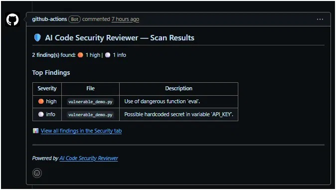

# AI Code Security Reviewer — GitHub Action

> Automated AI-powered code security scanning as a GitHub Action. Part of the [AI Code Security Reviewer](https://github.com/nrdiiin/ai-code-security-reviewer) ecosystem.

This **composite action** orchestrates the [AI Code Security Reviewer CLI](https://github.com/nrdiiin/ai-code-security-reviewer-cli) in your CI/CD pipeline. It scans your code, generates SARIF reports for GitHub Code Scanning, and posts PR comments with findings.

## Quick Start

Add this to your workflow (e.g. `.github/workflows/security.yml`):

```yaml
name: Security Scan
on: [pull_request]

permissions:
  contents: read
  security-events: write
  pull-requests: write

jobs:
  scan:
    runs-on: ubuntu-latest
    steps:
      - uses: actions/checkout@v4
      - uses: nrdiiin/ai-code-security-reviewer-action@v1
```

That's it! The action will scan your code and comment on PRs automatically.

## Example Output

Here's what a PR comment looks like when the action finds issues:



SARIF results are also uploaded to GitHub's Security tab for inline code annotations.

## Inputs

| Input | Description | Default |
|-------|-------------|---------|
| `path` | Directory or file path to scan | `.` |
| `fail-on` | Severity threshold to fail the action (`critical`, `high`, `medium`, `low`, `info`) | `high` |
| `ignore` | Comma-separated glob patterns to exclude | `""` |
| `comment-pr` | Post a comment on PRs with scan results (`true`/`false`) | `true` |
| `github-token` | GitHub token for API calls | `${{ github.token }}` |

## Outputs

| Output | Description |
|--------|-------------|
| `findings-count` | Total number of findings |
| `sarif-file` | Path to the generated SARIF file |

## PR Comment Preview

When the action finds issues, it posts a comment like this:

---

### 🛡️ AI Code Security Reviewer — Scan Results

**3 finding(s)** found: 🔴 1 critical | 🟠 1 high | 🟡 1 medium

| Severity | File | Description |
|----------|------|-------------|
| 🔴 critical | `auth.py` | SQL injection vulnerability |
| 🟠 high | `api.py` | Missing authentication check |
| 🟡 medium | `utils.py` | Unsafe deserialization |

📊 [View all findings in the Security tab](https://github.com/owner/repo/security/code-scanning)

---

When there are no findings:

> ✅ **No security findings!** Your code looks clean.

## Custom Configuration

```yaml
- uses: nrdiiin/ai-code-security-reviewer-action@v1
  with:
    path: "src/"
    fail-on: "medium"
    ignore: "**/test/**,**/vendor/**"
    comment-pr: "true"
```

## Required Permissions

Your workflow needs these permissions:

```yaml
permissions:
  contents: read
  security-events: write   # Upload SARIF to Code Scanning
  pull-requests: write     # Post PR comments
```

## Ecosystem

| Repo | Purpose |
|------|---------|
| [ai-code-security-reviewer](https://github.com/nrdiiin/ai-code-security-reviewer) | Core SDK — scanning engine |
| [ai-code-security-reviewer-cli](https://github.com/nrdiiin/ai-code-security-reviewer-cli) | CLI tool — wraps the SDK |
| **ai-code-security-reviewer-action** ← you are here | GitHub Action — runs the CLI in CI |

## License

MIT
